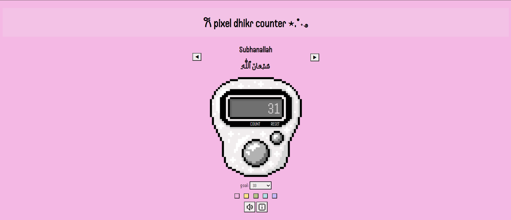
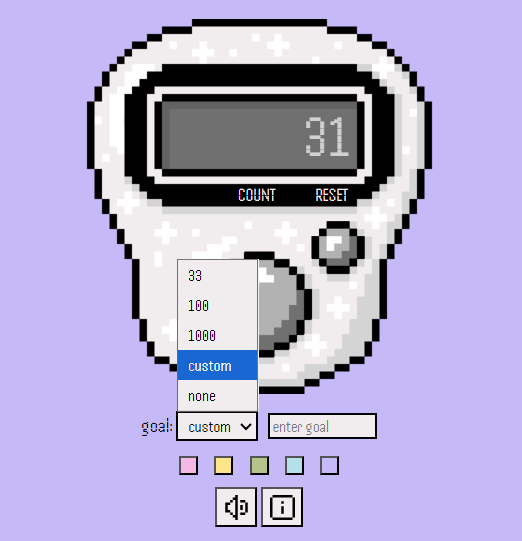
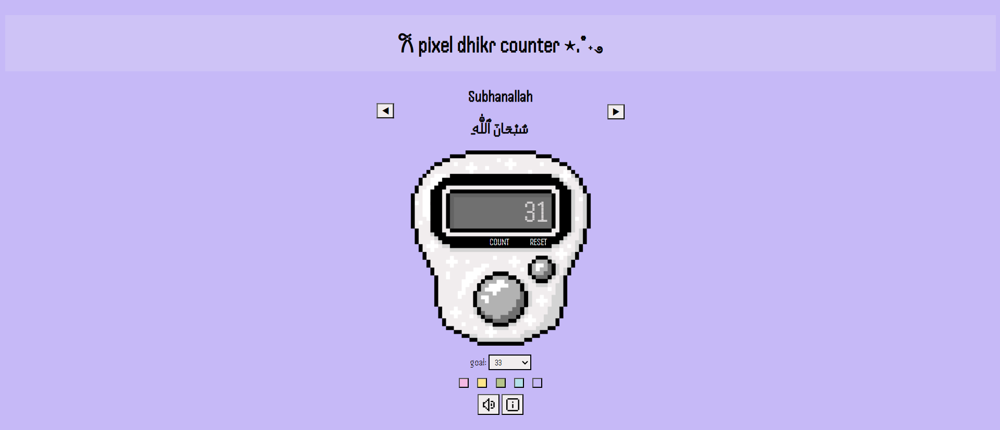
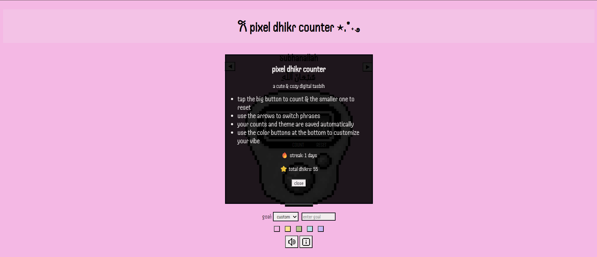

# 𐙚 pixel dhikr counter ⋆.˚˖࿔ ࣪
hiya!! this is the pixel dhikr counter web-app i built for horizons :)

︶⊹︶︶୨୧︶︶⊹︶

## ✧ about the project
i built this web-app because i personally use digital dhikr counters a lot lol. however ive never encountered a really cute and aesthetic one yet, thats why i decided to build one in pixelart/tamagotchi style! :D

︶⊹︶︶୨୧︶︶⊹︶

## how the app works  𑣲⋆｡˚ ⟡˖ ࣪

u can tap the big button on the counter pixelart or press SPACE to count ur dhikr and the smaller button on the right to reset ur score  -> u can see the score on the small screen on the counter :3

(for ppl who dont know how this works: dhikr is basically the remembrance of God and the phrases are like blessed phrases u recite to glorify God -> ppl often use those dhikr/tasbih counters to count how often they recited them bc every time u do that u basically get a point so one can kinda gamify the process ig to stay more motivated)

u can use the arrow buttons on the sides of the phrases to switch between phrases, but keep in mind each phrase has its own score so u will start from 0... the phrase below is the arabic phrase and the one above basically the pronunciation written in latin letters :)

below the counter u can set a target score (either a preset like 33 or 100 or ur own or u can ofc also decide to do ur own thing and have no goal). 

below that are the color btns where u can customize the background color to change the vibe a little bit

here is an example with a purple bg: 

on the very bottom there are two buttons the left one can turn the clicking sounds off and on and the right one opens the info menu...

the info menu includes a quick guide on how the app works as well as the users personal daily streak and their total dhikrs
here is a screenshot of the info screen:

︶⊹︶︶୨୧︶︶⊹︶

## 🛠 tech stack
* html5
* css3
* javascript
* github pages for hosting

︶⊹︶︶୨୧︶︶⊹︶

## problems that occured while coding ⋆｡˚𑣲⋆｡˚
* detaching the buttons from the pixelart and finding the spot they were originally at was kinda hard tbh
* a really weird problem that occured with my vscode that i thought at first was a bug and sat for like an hour at to debug only to turn out to be vscode messing with me (it didnt want the counter to surpass 1 so i switched to chrome lol)
* at first i also wanted to make the counter switch to the bg color after the user hits their target but sadly that didnt work and i gave up after like an hour (maybe i can try again later) -> but at least there is a blinking animation now haha

︶⊹︶︶୨୧︶︶⊹︶

## AI disclosure ⋆✴︎˚｡⋆
i used ai mostly to fix bugs or to help me with brainless tasks like indenting 30 lines of code or smth... i however DID NOT use ai to draw the pixelart for me or anything similar!! i drew it myself actually with a pixelart app on my ipad lol :)

︶⊹︶︶୨୧︶︶⊹︶

## ₊˚⊹ ࿔ how to visit

u can now visit the live online version here: **https://daliisalm22.github.io/pixel-dhikr-counter/**

︶⊹︶︶୨୧︶︶⊹︶

## app demo video ^^

https://github.com/user-attachments/assets/efac0a20-d5f7-4aa7-b1f0-e43ead92165c

︶⊹︶︶୨୧︶︶⊹︶

## i hope u enjoy trying out the app!! ⋆𐙚₊˚⊹♡
